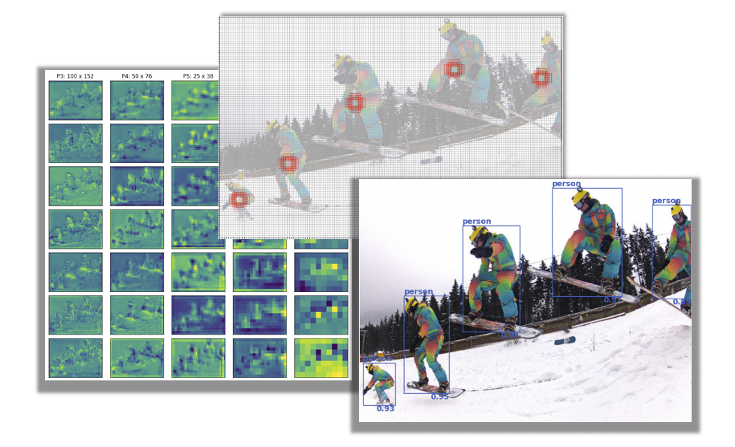

# Object Detection Inference: _Visualized_





This repository offers a blog-style Streamlit application to help visualize the inference workflow of a single-stage object detector. Specifically, we see how a [RetinaNet](https://arxiv.org/abs/1708.02002) architecture processes an image to quickly and accurately detect objects, while also exploring the following fundamental object detection concepts along the way:

- Multi-scale feature extraction with Feature Pyramid Networks (FPNs)
- Inline anchor box generation with Region Proposal Networks (RPNs)
- Detection post-processing with Non-Maximum Suppression (NMS)

Throughout the repo, we utilize a [PyTorch implementation of RetinaNet](https://github.com/pytorch/vision/blob/master/torchvision/models/detection/retinanet.py) that has been pre-trained on the [Common Objects in Context (COCO) 2017](https://cocodataset.org/#home) dataset. 

## Repository Structure

This project is organized with the following directory structure:

```
.
├── cml                           # Scripts that facilitate the project setup on CML
    ├── install_dependencies.py
    └── launch_app.py
├── app                           # Streamlit application files
    ├── SessionState.py
    ├── app.py
    └── app_pages.py
├── src                           # Modules supporting the model, data, and application
    ├── anchor_utils.py
    ├── app_utils.py
    ├── data_utils.py
    ├── model_utils.py
    └── retinanet.py
├── data                           # Storage directory for data assets
├── images
├── LICENSE
├── README.md  
├── requirements.txt 
└── .project-metadata.yaml
```


## Deploying on CML

There are three ways to launch this project on CML:

1. **From Prototype Catalog** - Navigate to the Prototype Catalog on a CML workspace, select the "Object Detection Inference: _Visualized_" tile, click "Launch as Project", click "Configure Project"
2. **As ML Prototype** - In a CML workspace, click "New Project", add a Project Name, select "ML Prototype" as the Initial Setup option, copy in this repo URL, click "Create Project", click "Configure Project"
3. **Manual Setup** - In a CML workspace, click "New Project", add a Project Name, select "Git" as the Initial Setup option, copy in the repo URL, click "Create Project". Launch a Python 3 Workbench Session and run `!pip3 install -r requirements.txt` to install requirements. Then create a CML Application as described in the [CML documentation](https://docs.cloudera.com/machine-learning/1.1/applications/topics/ml-applications.html), using `app/app.py` as the launch script.


## Setup outside of CML

The code and applications within were developed against Python 3.8.6. To setup the application outside of a CML environment,  first create and activate a new virtual environment through your preferred means, then pip install dependencies from the requirements file:

```bash
python3 -m venv .venv
source .venv/bin/activate
pip3 install -r requirements.txt
```

To start the application, run the following command from the root directory of the repo:

```
streamlit run app/app.py
```

**Note -** you may need to configure ports depending on where the application is launched from.


